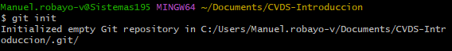
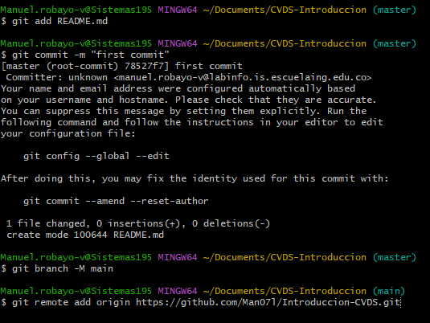
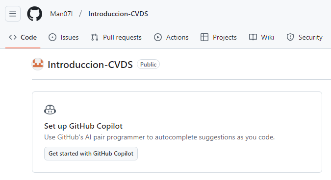
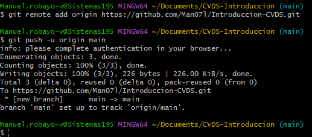
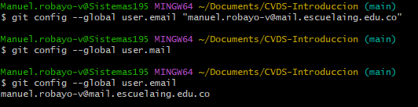
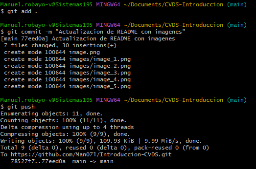

# LABORATORIO 1- INTRODUCCIÓN GIT
## PARTE I (Trabajo Individual). 

1.	Crea un repositorio localmente.
    

2.	Agrega un archivo de ejemplo al repositorio, el **README.md** puede ser una gran opción.
    

3.	Averigua para qué sirve y como se usan estos comandos **git add** y **git commit -m “mensaje”**
    **git add:** Mueve los cambios del directorio de trabajo al área del entorno de ensayo.  
    **git commit -m ""mensaje"":** Indica a Git que se van a guardar cambios en un commit, que es como una instantanea 
                                   de el proyecto en un momento especifico.  
    
4.  Abre una cuenta de github, si ya la tienes, enlazala con el correo institucional.

5.  Crea un repositorio en blanco (vacío) e GitHub.
    

6.  Configura el repositorio local con el repositorio remoto.

7.  Sube los cambios, teniendo en cuenta lo que averiguaste en el punto 3.

    

8.  Configura el correo en git local de manera correcta Configurar correo electrónico en GitHub
    

9.  Vuelve a subir los cambios y observa que todo esté bien en el repositorio remoto (en GitHub).
    